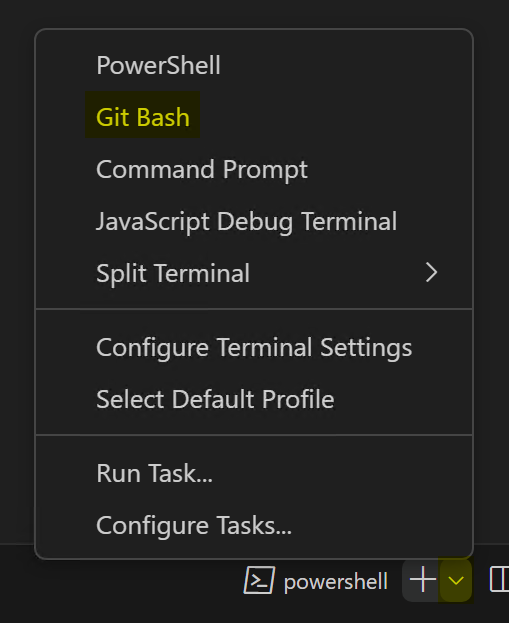

# Setting Up dbt

The following sections are covered in this document:

- Repo clone
- python evironment setup
- dbt installation

### Repo Clone
First you need to clone this repo locally using Visual studio code. For these instructions the feature/dev or dev branch will be the branches to work with.

If you do not get the Clone Repository option when selecting Source Control from the menu, then you have not installed GIT and will need to complete that first.


### Python Eevironment Setup

Once the repo has been cloned you can open a terminal window in VS Code and open a bash console.

In new terminal window there is a plus symbol with a drop down. Select this drop down and click Git Bash. This will open a bash console. 



To create a virtual python environment execute the code below, "dbt-env" being the name of your virtual environment:
```bash
# Python Virtual Environment
python -m venv dbt-env

```

To activate the environment execute this:
```bash
# Python Virtual Environment
source dbt-env/Scripts/activate

```


The virtual environment would have created a folder structure in your repo. This can be excluded in your gitignore file. If you used the default above it is already in the gitignore file.

### dbt Installation

Still in the bash console and having your virtual environment active, you can execute the following command to install all the components required for this dbt framework. The requirements.txt file is in the root of the repo.
```bash
# dbt installation
pip install -r requirements.txt

```
**NOTE:** The installation can take sometime to complete. It may look like it's hanging but it is busy executing. If you close the installation you can restart it using the same command above. It will skip any components already installed. 

This concludes the dbt installation.