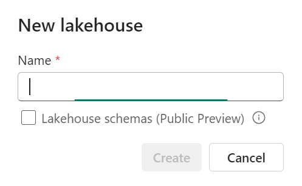

# Dbt Fabric Spark Notebook Generator (Dbt-FabricSparkNb)

<em>
<b>"The first and only dbt adapter for a true, modern, software-as-a-service (SAAS) Lakehouse."</b>
</em>

## What is it
The `dbt-fabricsparknb` package contains all of the code enabling dbt to work with Microsoft Fabric **WITHOUT** a connection endpoint like livy or the Datawarehouse SQL endpoint. 

## Why did we build it?
As a team of data specialists we have been working with dbt for a number of years. We have found that dbt is a powerful tool for data transformation, but it has some limitations. We have built this adapter to address some of these limitations and to make it easier to work with dbt in a modern, software-as-a-service (SAAS) lakehouse environment. 

## How does it work?
Dbt-FabricSparkNb works by leverging the power of the dbt-core, and the [dbt-fabrickspark](https://github.com/microsoft/dbt-fabricspark) apater to create a new adapter. As such, it can be described as a "child apater" of [dbt-fabrickspark](https://github.com/microsoft/dbt-fabricspark). 

The adapter inherits all of the functionality of the [dbt-fabrickspark](https://github.com/microsoft/dbt-fabricspark) adapter and simply extends it to meet the unique requirements of our project.

Consequently, to use this adapter, you will need to install the [dbt-fabrickspark](https://github.com/microsoft/dbt-fabricspark) adapter and then install the [dbt-fabricksparknb](https://github.com/Insight-Services-APAC/APAC-Capability-DAI-DbtFabricSparkNb) adapter.

## Key Features

- [x] Support for SAAS only lakehouse architecture (No PAAS components requried)
- [x] Support for lightweight, disconnected local development workflow
- [x] Fully featured with modern data transformation capabilities such as data lineage, data catalog, data quality checks and templated data transformation activities
- [x] Opensource and free to use
- [x] Extensible and customisable

## Unsupported features
Our DBT framework does not yet support schemas in Data lake. So please do not tick "Lakehouse schemas (Public Preview)" when creating the lakehouse in your workspace for now.

## Getting Started

-   :material-clock-fast:{ .lg .middle } __User Guide__

    ---

    For data engineers looking to use the adapter to create data transformation projects

    [:octicons-arrow-right-24: User Guide](./user_guide/index.md)

    !!! note
        This is the guide appropriate for **MOST** users.

-   :octicons-tools-16:{ .lg .middle } __Developer Guide__

    ---

    For advanced users looking to extend or customise the adapter

    [:octicons-arrow-right-24: Developer Guide](./developer_guide/applications_setup.md)

    !!! danger
        This is the guide for advanced users only.

-   :octicons-file-code-16:{ .lg .middle } __Documentation Guide__

    ---

    For users who are looking to contribute to the adapter documentation

    [:octicons-arrow-right-24: Documentation Guide](./documentation_guide/index.md)

    !!! warning
        This guide is still under construction
    

## Contributing
### Branching
When creating a branch to work on from please use the branch name of `feature/YourBranchName`. The case on `feature/` matters so please make sure to keep it lower case. Pull requests are to be made into the "dev" branch only. Any pull requests made into "Main" will be removed and not merged.

## Community

### Logging to Delta

Logging was previously done to a log file saved in the lakehouse and in json format. This has been changed to now log to a delta table in the lakehouse.

It works using 2 tables *"batch"* and *"execution_log"*. At the start of the ETL the Prepare step will check if the tables exist and if they don't they will be created. This is followed by a check for an *"open"* batch and where the batch is still open it will fail. 

If you need to close the batch manually, this code is available at the end of the master notebook. 

If this check passes, a batch will be opened. There are steps in each master numbered notebook to check for failures in previousn notebook runs and this is done using the open batch so previous ETL executions with failures are not picked up and return false stops on the current execution.
