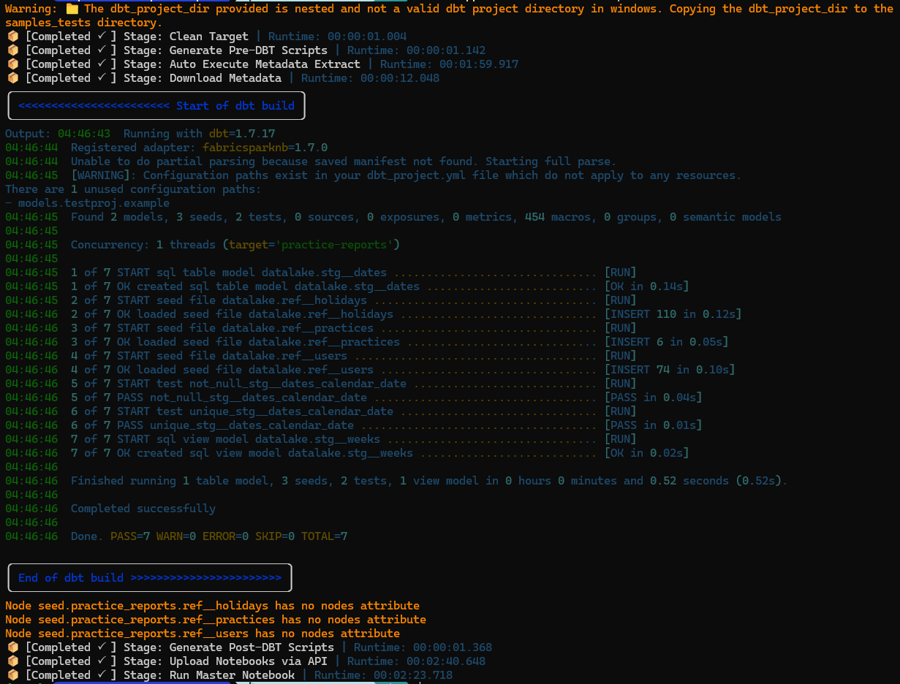

---

    title: "Dbt Build Process"
    excerpt: "This guide will walk you through the process of building your dbt project using the dbt-fabricsparknb package."
    sidebar_label: "Dbt Build Process"
    slug: /user_guide/dbt_build_process
    weight: 3

---

## Dbt Build Process & Dbt_Wrapper
The dbt-fabricksparknb package includes a console application that will allow you to build your dbt project and generate a series of notebooks that can be run in a Fabric workspace. This application is called `dbt_wrapper` and is a python script that is run from the command line. You can invoke the application and view information about it by running the following command in a terminal.

!!! Important
  
    Before running the dbt_wrapper make sure you're logged into your tenant in the PowerShell terminal using both az login. See the examples below and replace the tenant id with your own.

    ```powershell
    az login --tenant 73738727-cfc1-4875-90c2-2a7a1149ed3d --allow-no-subscriptions
    ```


!!! Note
    Make sure that you have activated your python virtual environment before running this code. 

```powershell
dbt_wrapper --help
```

To build your dbt project and publish your notebook to your Fabric workspace you can run the command below:

!!! note
    Be sure to replace ==my_project== with the name of your dbt project folder

!!! important
      Before running the dbt_wrapper make sure you're logged into your tenant in the PowerShell terminal using both `az login` and `azcopy login`. See the examples below and replace the tenant id with your own.
    ```powershell
    az login --tenant 73738727-cfc1-4875-90c2-2a7a1149ed3d 
    azcopy login --tenant-id 73738727-cfc1-4875-90c2-2a7a1149ed3d 
    ```

```powershell
dbt_wrapper run-all my_project
```

The command above will carry out all of the necessary "stages" required to fully build your dbt project and generate the notebooks that can be run in a Fabric workspace. When run successfully your should see output similar to the image below.




## Toggling Build Stages Off and On 

There are times when you may not wish to run ALL of the build steps. In such circumstances you can toggle off specific stages by using the options built in to the `dbt_wrapper` application. To view all of the options available to you run the command below:

```powershell
dbt_wrapper run-all --help
```

For example, should you wish to run all stages except for the upload of the generated notebooks to your Fabric workspace you can run the command below:

```powershell
dbt_wrapper run-all my_project --no-upload-notebooks-via-api  
```
Alternatively, you might want to make use of some additional "helper" commands that we have included in the application. For example, you can run the run-all-local command to run all stages except for those that require a live Fabric connection. This is useful when you are testing the build process locally. To run this command you can use the command below:


```powershell
dbt_wrapper run-all-local my_project
```

Review all of the commands available to you by running using the help option as shown below:

```powershell
dbt_wrapper --help
```

!!! Info
    You are now ready to move to the next step in which you gain an understanding of the various kinds of notebooks generated by the adapter. Follow the [Understanding the Generated Notebooks](./generated_notebooks.md) guide.

  
